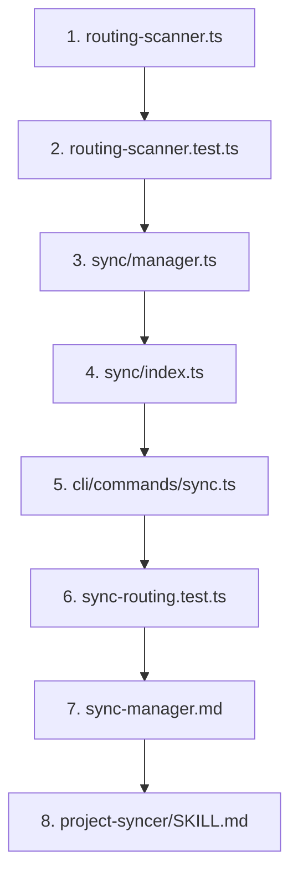

# Files to Change: Routing-Aware Sync

Quick reference for SPEC-20260105-routing-aware-sync implementation.

## New Files (3)

### 1. sdk/js/src/sync/routing-scanner.ts
**Purpose**: Core routing-aware file scanner
**Lines**: ~250
**Key Functions**:
- `scanCodexWithRouting()` - Main scanner function
- `extractProjectFromPath()` - Parse project from path
- `listAllFilesRecursive()` - Recursive file listing

**Dependencies**:
- `../core/routing/evaluator.js` (shouldSyncToRepo)
- `../metadata/parser.js` (parseMetadata)

### 2. sdk/js/src/sync/routing-scanner.test.ts
**Purpose**: Unit tests for routing scanner
**Lines**: ~200
**Test Coverage**:
- Multi-project file discovery
- Pattern matching (wildcards, specific patterns)
- Exclude patterns
- Edge cases (no frontmatter, malformed YAML)

### 3. cli/tests/integration/sync-routing.test.ts
**Purpose**: Integration tests for full sync flow
**Lines**: ~150
**Test Scenarios**:
- End-to-end routing with mock codex
- File discovery across projects
- Routing statistics validation

## Modified Files (5)

### 4. sdk/js/src/sync/manager.ts
**Changes**: Add routing-aware sync method
**Lines Added**: ~50
**New Methods**:
```typescript
async createRoutingAwarePlan(
  org: string,
  project: string,
  codexDir: string,
  options?: SyncOptions
): Promise<SyncPlan>
```

**Existing Methods**: Keep unchanged (backward compatibility)

### 5. sdk/js/src/sync/index.ts
**Changes**: Export routing scanner
**Lines Added**: ~3
**Exports**:
```typescript
export { scanCodexWithRouting, type RoutedFileInfo } from './routing-scanner.js'
```

### 6. cli/src/commands/sync.ts
**Changes**: Use routing sync for --from-codex
**Lines Modified**: ~30
**Location**: Line ~66 in action handler

**Before**:
```typescript
const plan = await manager.createPlan(org, project, sourceDir, targetFiles, options)
```

**After**:
```typescript
if (direction === 'from-codex') {
  const plan = await manager.createRoutingAwarePlan(org, project, codexDir, options)
  // Add routing stats to output
} else {
  const plan = await manager.createPlan(org, project, sourceDir, targetFiles, options)
}
```

### 7. plugins/codex/agents/sync-manager.md
**Changes**: Document routing-aware behavior
**Lines Added**: ~50
**Sections to Add**:
- "Routing-Aware Sync (v4.1+)"
- Cross-project knowledge sharing explanation
- Frontmatter pattern examples
- Performance characteristics

**Location**: After line ~40 (in WORKFLOW section)

### 8. plugins/codex/skills/project-syncer/SKILL.md
**Changes**: Update skill documentation
**Lines Added**: ~20
**Sections to Update**:
- CONTEXT - mention routing-aware behavior
- INPUTS - note that patterns are evaluated across entire codex

## Files Referenced (No Changes)

### 9. sdk/js/src/core/routing/evaluator.ts
**Status**: ✅ Use as-is
**Function Used**: `shouldSyncToRepo()`
**Why No Changes**: Already implements correct routing logic

### 10. sdk/js/src/metadata/parser.ts
**Status**: ✅ Use as-is
**Function Used**: `parseMetadata()`
**Why No Changes**: Already parses frontmatter correctly

### 11. docs/specs/SPEC-00004-routing-distribution.md
**Status**: 📖 Reference only
**Purpose**: Defines routing architecture that we're implementing

### 12. sdk/js/src/sync/planner.ts
**Status**: ✅ Use as-is
**Function Used**: `createSyncPlan()`
**Why No Changes**: Works correctly once given right input files

## Implementation Order



**Rationale**:
1. Core logic first (routing-scanner)
2. Test core logic in isolation
3. Integrate with sync manager
4. Wire up to CLI
5. Integration tests
6. Documentation last

## File Size Summary

| Type | Count | Total Lines |
|------|-------|-------------|
| New Implementation | 1 | ~250 |
| New Tests | 2 | ~350 |
| Modified Implementation | 3 | ~83 |
| Modified Documentation | 2 | ~70 |
| **Total** | **8** | **~753** |

## Dependencies Between Files

```
routing-scanner.ts
  ↓ uses
  ├─ core/routing/evaluator.ts (shouldSyncToRepo)
  ├─ metadata/parser.ts (parseMetadata)
  └─ schemas/metadata.ts (Metadata type)

sync/manager.ts
  ↓ uses
  └─ routing-scanner.ts (scanCodexWithRouting)

cli/commands/sync.ts
  ↓ uses
  └─ sync/manager.ts (createRoutingAwarePlan)
```

## Testing Dependencies

```
routing-scanner.test.ts
  ↓ tests
  └─ routing-scanner.ts

sync-routing.test.ts
  ↓ tests (integration)
  ├─ routing-scanner.ts
  ├─ sync/manager.ts
  └─ cli/commands/sync.ts
```

## Checklist for Each File

### routing-scanner.ts
- [ ] Define interfaces (RoutedFileInfo, RoutingScanOptions)
- [ ] Implement scanCodexWithRouting()
- [ ] Implement extractProjectFromPath()
- [ ] Implement listAllFilesRecursive()
- [ ] Add error handling
- [ ] Add JSDoc comments

### routing-scanner.test.ts
- [ ] Test multi-project discovery
- [ ] Test pattern matching
- [ ] Test exclude patterns
- [ ] Test edge cases
- [ ] Mock storage interface
- [ ] 80%+ coverage

### sync/manager.ts
- [ ] Import routing scanner
- [ ] Add createRoutingAwarePlan() method
- [ ] Convert RoutedFileInfo to FileInfo
- [ ] Add routing metadata to plan
- [ ] Keep existing methods unchanged

### sync/index.ts
- [ ] Export scanCodexWithRouting
- [ ] Export RoutedFileInfo type

### cli/commands/sync.ts
- [ ] Check direction === 'from-codex'
- [ ] Call createRoutingAwarePlan()
- [ ] Add routing stats to output
- [ ] Format output nicely

### sync-routing.test.ts
- [ ] Setup mock codex
- [ ] Test dry-run
- [ ] Test actual sync
- [ ] Test routing stats
- [ ] Test multiple projects

### sync-manager.md
- [ ] Add "Routing-Aware Sync" section
- [ ] Explain cross-project sharing
- [ ] Add frontmatter examples
- [ ] Document performance

### project-syncer/SKILL.md
- [ ] Update CONTEXT
- [ ] Update INPUTS
- [ ] Add routing examples

## Quick Start Command Sequence

```bash
# 1. Create routing scanner
touch sdk/js/src/sync/routing-scanner.ts
# Implement core logic

# 2. Create tests
touch sdk/js/src/sync/routing-scanner.test.ts
npm test -- routing-scanner.test.ts

# 3. Update sync manager
vim sdk/js/src/sync/manager.ts
# Add createRoutingAwarePlan method

# 4. Export from index
vim sdk/js/src/sync/index.ts
# Add export

# 5. Update CLI
vim cli/src/commands/sync.ts
# Switch to routing sync

# 6. Build and test
npm run build
npm test

# 7. Integration test
touch cli/tests/integration/sync-routing.test.ts
npm run test:integration

# 8. Update docs
vim plugins/codex/agents/sync-manager.md
vim plugins/codex/skills/project-syncer/SKILL.md

# 9. Manual test
fractary codex sync --from-codex --dry-run
# Should show hundreds of files from multiple projects
```

## Validation Commands

After each phase, run these to validate:

```bash
# After routing-scanner.ts
npm run build
npm test -- routing-scanner.test.ts

# After sync/manager.ts
npm test -- sync/manager.test.ts

# After cli/commands/sync.ts
npm run build
./dist/cli/index.js sync --help

# After all changes
npm test
npm run build
fractary codex sync --from-codex --dry-run
```

## Diff Summary

| File | +Lines | -Lines | Net |
|------|--------|--------|-----|
| routing-scanner.ts | +250 | 0 | +250 |
| routing-scanner.test.ts | +200 | 0 | +200 |
| sync-routing.test.ts | +150 | 0 | +150 |
| sync/manager.ts | +50 | 0 | +50 |
| sync/index.ts | +3 | 0 | +3 |
| sync.ts | +30 | -5 | +25 |
| sync-manager.md | +50 | 0 | +50 |
| project-syncer/SKILL.md | +20 | 0 | +20 |
| **Total** | **+753** | **-5** | **+748** |
